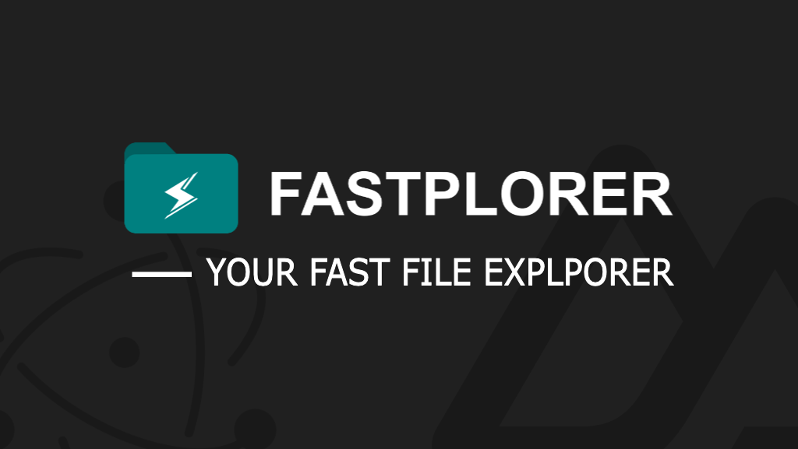

<center> 
<br><hr>

Welcome to the fastplorer project, a project build with <a href="https://nuxt.com/docs/getting-started/introduction">Nuxt</a> and <a href="https://www.electronjs.org/docs/latest/">Electron</a>. Fastplorer is a file explorer that uses columns (MAC finder experience) to browse through your files. It is also possible to search files anywhere on your disk with incredible speed!
</center>

## Features
- Browsing through folders
- Searching for files (search bar)

## Technologies  used
- [Nuxt 3](https://nuxt.com/docs/getting-started/introduction)
- [Electron](https://www.electronjs.org/docs/latest/)

## Setup (Nuxt)

Make sure to install the dependencies:

```bash
yarn install
```

Start the development server on `http://localhost:3000`:

```bash
yarn dev
```

## Production (Electron)

Build the application for production:

```bash
yarn app:make
```

Locally preview production build:

```bash
yarn app:start
```
